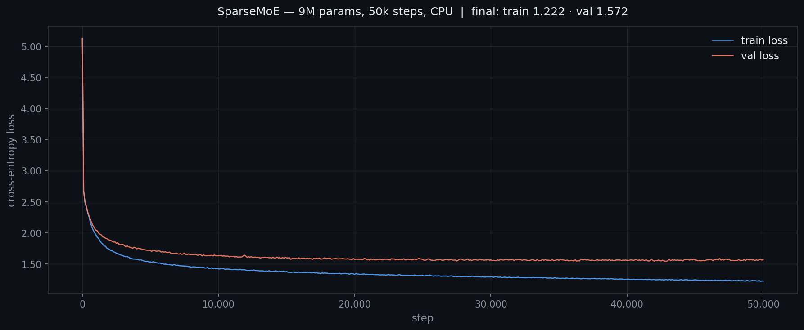

# MoE on Mac

I built this project to understand Mixture-of-Experts language models from scratch, then extend that foundation toward a GPT-2-scale model that trains entirely on Apple Silicon — no CUDA required. The starting point was a character-level sparse MoE trained on Shakespeare. The extension is a full MLX-native rewrite with subword tokenization, modern architecture components, and a real training corpus.

The strongest signal here is the research arc: implement the core MoE mechanics precisely, stress-test them on a real (if small) training run, document what breaks and why, then carry those lessons into a more serious architecture.

## Executive Summary

| Item | Details |
|---|---|
| **Base model** | Character-level sparse MoE transformer, ~9M parameters |
| **Architecture** | 8 experts, top-2 noisy routing, 8-layer transformer, `n_embed=128` |
| **Training hardware** | CPU only (Apple Silicon, MPS tested but slower due to sparse op fallbacks) |
| **Training run** | 50,000 steps, 569 minutes 48.7 seconds (~9.5 hours) |
| **Dataset** | Shakespeare (~1.1M characters, character-level tokenization, ~65 vocab) |
| **Saved weights** | `sparse_moe.pt` (excluded from git) |
| **Extension goal** | GPT-2-level performance (≥117M parameters, ≤3.28 cross-entropy on FineWeb val) running on MPS/MLX |
| **Extension framework** | MLX, BPE tokenization (32K vocab), RoPE, RMSNorm, ReLU², load-balanced MoE FFN |

**Status:** the base implementation is complete and trained. The extension is in progress — tokenizer and data pipeline phases are underway.

---

## Part 1 — Base Implementation

### What Was Built

A sparse MoE language model implemented from scratch in PyTorch, following the architecture from [Vizuara's MoE tutorial](https://www.youtube.com/watch?v=W7ktPe1HfZs). The key design decision is replacing the standard FFN layer in each transformer block with a sparse MoE layer — the router selects 2 of 8 experts per token, runs only those, and blends their outputs by gating weight.

**Core components:**

- `Expert` — two-layer MLP with ReLU activation (`d_model → 4d → d_model`) and dropout
- `NoisyTopkRouter` — linear router with learned Gaussian noise injected before top-k selection to encourage even expert utilization
- `SparseMoE` — batched dispatch: iterates over experts, gathers all tokens routed to each expert, runs one forward pass per expert rather than one per token
- `MultiHeadAttention` — standard scaled dot-product attention with causal masking
- `Block` — attention + sparse MoE with residual connections and LayerNorm
- `SparseMoeLanguageModel` — full model with token + positional embeddings, stacked blocks, and an `lm_head`

Primary code: [`base.ipynb`](base.ipynb)

### Architecture Details

| Hyperparameter | Value |
|---|---|
| Parameters | ~8.996M |
| Layers (`n_layer`) | 8 |
| Embedding dim (`n_embed`) | 128 |
| Attention heads (`n_head`) | 8 |
| Context length (`block_size`) | 32 |
| Number of experts | 8 |
| Top-k | 2 |
| Dropout | 0.1 |
| Activation | ReLU |
| Positional encoding | Learned absolute |
| Tokenization | Character-level (~65 vocab) |
| Weight init | Kaiming normal |

### Training Run

Trained for 50,000 steps on CPU. MPS (Metal Performance Shaders) was tested but consistently slower — the `SparseMoE` forward pass uses boolean masking and fancy indexing (`flat_x[flat_mask]`, `.scatter()`) that MPS does not fully support natively, causing silent CPU fallbacks and constant CPU↔GPU transfers that dominate runtime for this model size.

| Metric | Value |
|---|---|
| Steps | 50,000 |
| Wall time | 569m 48.7s (~9.5 hours) |
| Hardware | CPU (Apple Silicon) |
| Optimizer | AdamW, `lr=1e-3` |
| Batch size | 16 |
| Eval interval | every 100 steps |



```python
# inference
context = torch.zeros((1, 1), dtype=torch.long, device=device) # start with a single token (B=1, T=1)
print(decode(model.generate(context, max_new_tokens=2000)[0].tolist())) # generate 500 new tokens and decode to string
```

```
ROMEO:
Well, by leave, I say, believe with me: have not advised
Me to worse than when one seasons
Who maidest my memory. Let them weap.
My gracious love I are patient but you feel
In peril couns' and hear this man,
Pointing a ballad bosom. The coward king's tonight soon.

PARIS:
Hold ye, sir.

DORCAS:
I may: he say Worthy set them burse;
Lest that bear the envy in us fail!

ABRAHAM:
Come, gentle Troy, and so I out raise.

Justice:
Some others, heaath!
They do lose a Christendom can seem a push.

SAMPSON:
I of it?

Nurse:
Well then, masters as much may be;
And flatter your former, father,
You pray a while man; longs may, give before the sovereign.

WESTMORELAND:
Who will true-sort! who comest this John of Caius Marcius.

Gardener:
I, that to the people: who, as veeun were you:
I say!
If you arrive against the day again.
After you, sir, and made you forsworn by this weather,
Protest but rather ran and beauty could seem;
I sliply but up my love do you for, I bess you.

YORK:
Eve-father York was like a fearful till enemy to perjure,
This few day of pledge out at last!
We'll plead fortune Warwick that by out open one sels.

Nurse:
Stepher, too then, my loss Marcius,
And sent his wit i' the earth.

EXTON:
Of that you may last if whose lewd ride by Tybalt's name?

POMPEY:
Messenger and Sir Jorious cross you,
Mock'd upon me yeat; but the
changed with outwing lazy changes Aufidius,
And that you ove the lash, I here will claim his canopy.
Somewhat complace I have been scars to
A whipful provost, here arise,
Our issue being thy divines, that keeps you are ignorant: our curses it.

ROEEO:
Good madam!

KING RICHARD II:
Do then, to Warwick: here he
must e'er he be strike,--

BARNUTHAS:
Why do I love my hand unto their virtuously told,
And smated your steed stirOn; no noble
Prince of such a paralousible and either.

Nurse:
Pay my fearful suke;
Or, let our speed with treasures that thou cast
To England's revolt to the crown.
But looks in mitinous urdenonance let the son alone.

AN
```

Trained weights are saved to `sparse_moe.pt` and excluded from git (`.gitignore` covers `*.pt`).

To load and run inference:

```python
model = SparseMoeLanguageModel()
model.load_state_dict(torch.load('sparse_moe.pt', map_location=device))
model.to(device)
model.eval()

prompt = "To be or not"
context = torch.tensor(encode(prompt), dtype=torch.long, device=device).unsqueeze(0)
print(decode(model.generate(context, max_new_tokens=500)[0].tolist()))
```

### Why the Batched Expert Dispatch Matters

The `SparseMoE` forward loop iterates over experts rather than tokens. For each expert `i`, it gathers all tokens assigned to that expert into a single batch and runs one matrix multiply:

```python
for i, expert in enumerate(self.experts):
    expert_mask = (indices == i).any(dim=-1)
    expert_input = flat_x[flat_mask]          # (N_i, d_model)
    expert_output = expert(expert_input)       # one forward pass for all N_i tokens
```

The alternative — looping over tokens and calling each expert individually — would mean `seq_len × top_k` forward passes each with batch size 1. GPUs (and to a lesser extent CPUs) are optimized for large matrix multiplies. The cost of a `nn.Linear` is dominated by loading the weight matrix `W`, not computing with it — batching amortizes that load across all tokens at once.

### Limitations

- **Character-level tokenization:** ~65-token vocab vs. 50k+ subword tokens in modern models. The model can learn Shakespeare-shaped statistics but has no concept of words, so output is superficially plausible but semantically incoherent.
- **Model scale:** ~9M parameters vs. 117M for GPT-2 small. Expressiveness is fundamentally limited.
- **Training budget:** 50,000 steps is short for this architecture and dataset. Loss continues declining at the end of the run.
- **No auxiliary load balancing loss:** the noisy top-k routing helps but doesn't guarantee uniform expert utilization. Expert collapse is possible over longer runs.
- **ReLU instead of GELU:** transformer FFNs standardly use GELU; ReLU was used here for simplicity.
- **Learned absolute positional embeddings:** limited to `block_size=32` tokens; RoPE would generalize better.
- **MPS incompatibility:** sparse indexing ops in `SparseMoE` fall back to CPU on MPS, making MPS slower than CPU for this model at this scale.
- **Single dataset:** Shakespeare only. No pretraining corpus diversity.

---

## Part 2 — Extension: MLX-Native GPT-2-Scale MoE

### Goal

Design and train a sparse MoE language model that achieves at least GPT-2-level performance (117M+ effective parameters, ≤3.28 cross-entropy on FineWeb val) while running entirely on Mac hardware. No CUDA. No cloud.

The base implementation proved out the MoE mechanics. The extension addresses every structural limitation of the base: tokenization, scale, architecture components, training corpus, and hardware compatibility.

### Why MLX Over PyTorch + MPS

The base run showed the core problem with MPS + PyTorch for sparse MoE: the boolean masking and scatter ops that make `SparseMoE` efficient are not well-supported by the MPS backend, causing silent CPU fallbacks. MLX is Apple's own ML framework built for unified memory on Apple Silicon — it doesn't have this problem because its op set was designed with the hardware in mind. `mx.fast.scaled_dot_product` and `mx.fast.rms_norm` are native, and the unified memory model eliminates the CPU↔GPU transfer penalty that killed MPS performance in the base run.

### Architecture Changes from Base

| Component | Base | Extension |
|---|---|---|
| Framework | PyTorch | MLX |
| Tokenization | Character-level (~65 vocab) | BPE, 32K vocab (HuggingFace `tokenizers`) |
| Positional encoding | Learned absolute | RoPE |
| Attention | Standard scaled dot-product | QK-Norm + `mx.fast.scaled_dot_product` |
| Layer norm | LayerNorm | RMSNorm (`mx.fast.rms_norm`) |
| Activation | ReLU | ReLU² |
| Value embeddings | Standard | Alternating-layer value embeddings |
| MoE routing | Noisy top-k, no aux loss | Noisy top-k + auxiliary load balancing loss |
| Optimizer | AdamW | Muon (weight matrices) + AdamW (embeddings/head) |
| Dataset | Shakespeare (~1.1M chars) | FineWeb-Edu sample-10BT (~28.5GB) |
| Hardware target | CPU (MPS tested, slower) | MPS-native via MLX |

### Load Balancing Loss

The base model has no explicit pressure toward uniform expert utilization. The extension adds an auxiliary loss term:

```
L_aux = num_experts × Σ_i (f_i × p_i)
```

where `f_i` is the fraction of tokens routed to expert `i` and `p_i` is the mean router probability for expert `i`. This is added to the main cross-entropy loss with a small coefficient (e.g. `0.01`). If one expert monopolizes tokens, `f_i` grows large and the optimizer pushes back. Expert utilization is logged per step to watch for collapse.

### Build Plan

See [`PLAN.md`](PLAN.md) for the full phase breakdown. Summary:

| Phase | Goal |
|---|---|
| 0 — Environment | pyenv, venv, MLX 0.31+, support packages |
| 1 — Tokenizer | 10GB FineWeb-Edu sample → BPE 32K vocab → `tokenizer.json` |
| 2 — Data pipeline | Stream FineWeb-Edu, tokenize to uint16 `.bin` shards, `np.memmap` loader |
| 3 — Model (MLX) | RoPE, QK-Norm, RMSNorm, ReLU², MoE FFN with load balancing |
| 4 — Training | Muon + AdamW, `mx.compile`, checkpoint every 2h |
| 5 — Evaluation | FineWeb val loss, HellaSwag, LAMBADA, WikiText-103, router monitoring |

**Current status:** Phase 0 complete. Phase 1 in progress — FineWeb-Edu streaming is set up, BPE training pending.

### Project Structure

```
moe-llm/
├── tokenizer/
│   └── train_tokenizer.py
├── data/
│   ├── download_fineweb.py
│   ├── tokenize_shards.py
│   └── edu_fineweb10B/         # ~28.5GB .bin shards (gitignored)
├── model/
│   └── train_tokenizer.py      # MLX model components (in progress)
├── train.py
├── eval.py
└── checkpoints/                # Saved weights (gitignored)
```

### Performance Target

| Metric | Target |
|---|---|
| Val cross-entropy | ≤3.28 (GPT-2 small baseline on FineWeb) |
| HellaSwag | Competitive with GPT-2 small (~29%) |
| Hardware | Apple Silicon, MPS via MLX, no CUDA |
| Expert utilization | ~25% per expert (8 experts, top-2) with no collapse |

---

## Setup

```bash
# base implementation
conda create -n moe_on_mac python=3.12
conda activate moe_on_mac
pip install torch

# run base.ipynb — Shakespeare data downloads automatically via wget
# set device = 'cpu' (MPS is slower for this model due to sparse op fallbacks)
```

```bash
# extension (MLX)
pip install mlx datasets tokenizers numpy
```

---

## Notes

- Inspired by [Vizuara — Code Mixture of Experts (MoE) from Scratch in Python](https://www.youtube.com/watch?v=W7ktPe1HfZs)
- Trained and developed exclusively on Mac
- `sparse_moe.pt` excluded from git via `*.pt` in `.gitignore`
- `moe-llm/data/` excluded from git except `.py` scripts
